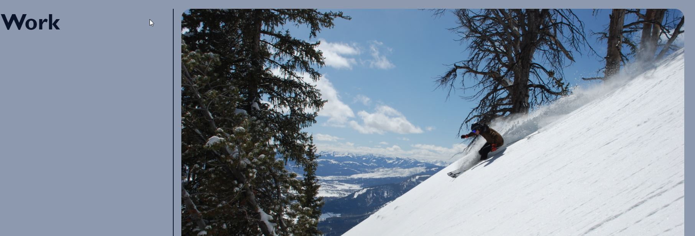
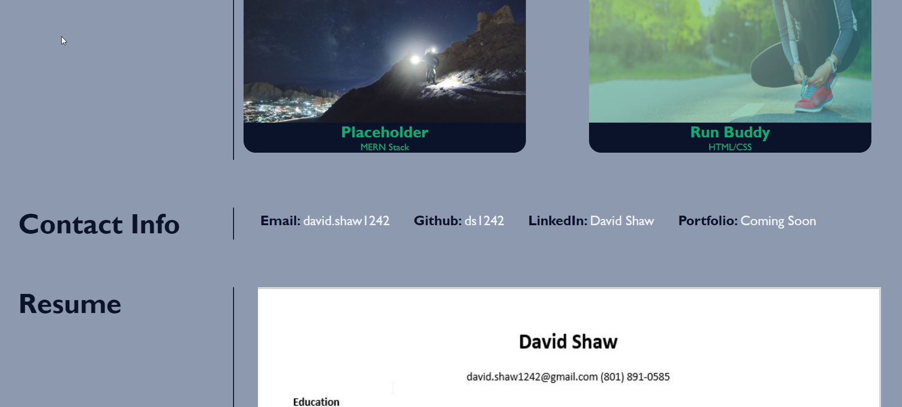

# Challenge 2: Create Porfolio

## About/Description
This page is second the challenge for the code bootcamp.  It needed to fulfill the requirements laid out in the provided User Story and Requirements.  I created this page to highlight my work.  I followed some of the layout in the demo provided but added my own photos and styling to the page.  It has links in the navigation bar at the top which jumps down to the associated page.  The main card is larger than the four sub cards.  I created a placeholder page so when the image links are clicked on the cards it takes you to a blank page that states it is a placeholder.  With the exception of the run-buddy card as that takes you to run-buddy page created during the modules.  I did use the sub-titles of the cards based on the example demo.  I have working links in the contact information section.  Below the contact information, I have a screenshot of the upper portion of my old resume which is a clickable link as the portfolio sections and it downloads an old version of my resume. 

### User Story
AS AN employer
I WANT to view a potential employee's deployed portfolio of work samples
SO THAT I can review samples of their work and assess whether they're a good candidate for an open position

### Acceptance Criteria
GIVEN I need to sample a potential employee's previous work
WHEN I load their portfolio
THEN I am presented with the developer's name, a recent photo, and links to sections about them, their work, and how to contact them
WHEN I click one of the links in the navigation
THEN the UI scrolls to the corresponding section
WHEN I click on the link to the section about their work
THEN the UI scrolls to a section with titled images of the developer's applications
WHEN I am presented with the developer's first application
THEN that application's image should be larger in size than the others
WHEN I click on the images of the applications
THEN I am taken to that deployed application
WHEN I resize the page or view the site on various screens and devices
THEN I am presented with a responsive layout that adapts to my viewport

## Built With
* HTML
* CSS

## Website
https://ds1242.github.io/Portfolio_Challenge2/ 

## Screenshots

## Contributions
Made by David Shaw